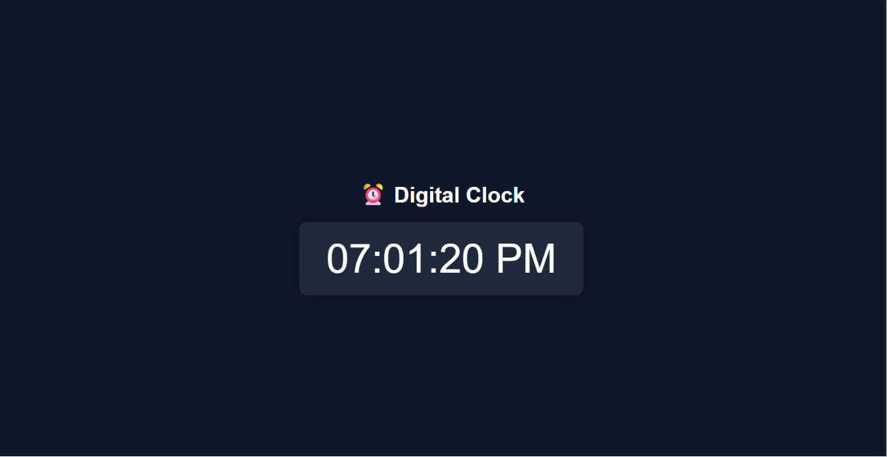

# ⏰ Digital Clock

A simple Digital Clock built using **HTML, CSS, and JavaScript**.  
It displays the current system time and updates every second in real time.

---

## Features

- Live digital clock
- Updates every second automatically
- 12-hour format with AM/PM 
- Clean and responsive UI

---

##  Tech Stack

- HTML
- CSS
- JavaScript

---

##  Screenshot

---

