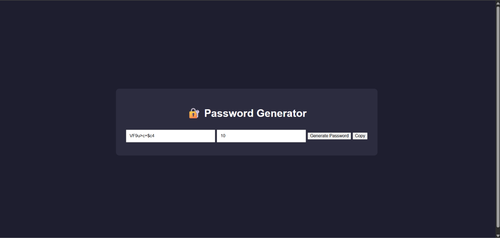

# 🔐 Password Generator

A simple and interactive Password Generator built using **HTML, CSS, and JavaScript**.  
This project helps generate strong random passwords with a single click and supports clipboard copying for easy use.

---

## Features

- Generate random strong passwords
- Adjustable password length
- Includes uppercase, lowercase, numbers, and symbols
- One-click copy to clipboard 
- Simple and clean UI
- Beginner-friendly JavaScript logic

---

## Tech Stack

- HTML5
- CSS3
- JavaScript (Vanilla JS)

---

## Concepts Used

- DOM Manipulation
- Random Function (`Math.random`)
- Clipboard API (`navigator.clipboard`)
- Event Handling
- Basic UI Design

---

## Project Preview

